# Authentication and Authorization for Web based enterprise applications

Authentication, Authorization and User Management for enterprise applications using ASP.NET Core operate slightly different to the included Identity example.
The MVC template presupposes a web application where users are allowed to register themselves.

This example explores the requirement for a system manager to control account registrations, password resets and authorizations. 
It uses a dynamic application role approach using claim policies and requirement handlers.

## Authentication
Identity is now contained in a separate class (Razor Pages) and can be scaffolded into an existing application.

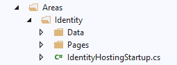

It is recommended not to scaffold all items. We just need to identify the items to be changed and override them. 

### Login


First item to be considered is the default login screen which prompts for email and password.

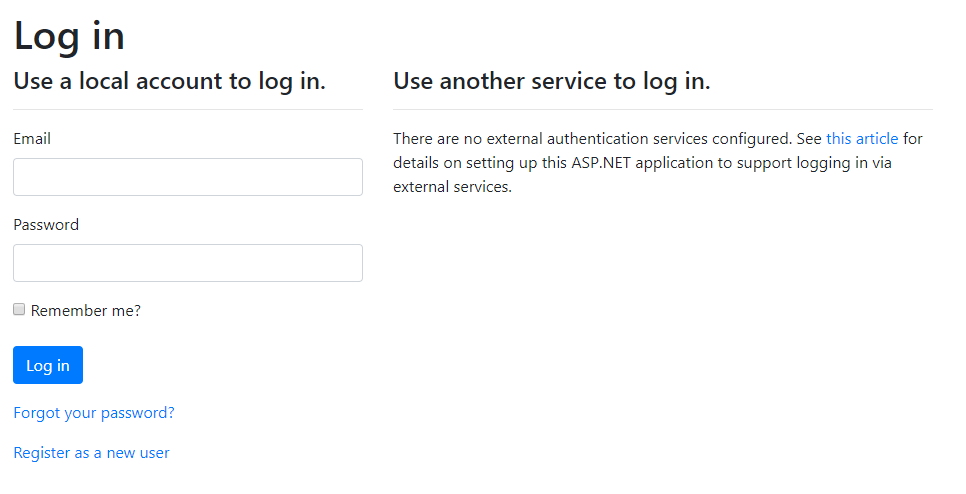

We will change the login screen by replacing email with username and removing the other services option. But we should first identify the data we need for user registration.

```
public class WebApplication2User : IdentityUser
    {
        public string Surname { get; set; }
        public string FirstName { get; set; }
        public string MiddleName { get; set; }
        public string EmployeeNumber { get; set; }

    }
```
At a minimum we need to capture the names of the user (separate from username which is already part of the Identity).
So we can scaffold a new context for identity and extend the IdentityUser class with name and employeenumber.


In the Package Manager console

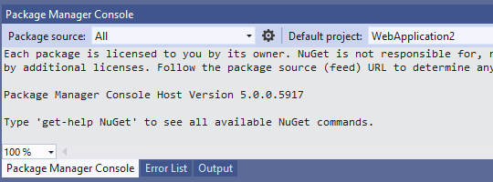

Enter

Add-Migration CreateIdentitySchema

Update-Database

The generated asp net users table now contains these fields

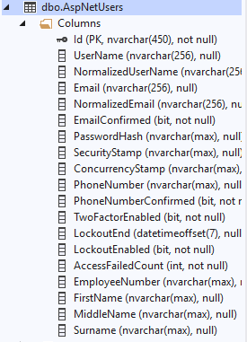

The Login.cshtml.cs class contains an Email property which we need to replace with a Username property

```
public class InputModel
        {
            [Required]
            [EmailAddress]
            public string Email { get; set; }

            [Required]
            [DataType(DataType.Password)]
            public string Password { get; set; }

            [Display(Name = "Remember me?")]
            public bool RememberMe { get; set; }
        }
```

becomes

```
public class InputModel
        {
            [Required]
            public string Username { get; set; }

            [Required]
            [DataType(DataType.Password)]
            public string Password { get; set; }

            [Display(Name = "Remember me?")]
            public bool RememberMe { get; set; }
        }
```

and changing 

```
var result = await _signInManager.PasswordSignInAsync(Input.Email, Input.Password, Input.RememberMe, lockoutOnFailure: true);
```
to
 
```
var result = await _signInManager.PasswordSignInAsync(Input.Username, Input.Password, Input.RememberMe, lockoutOnFailure: true);
```

Change the Login.cs view to relect the change from using email to username for login

```
                <div class="form-group">
                    <label asp-for="Input.Username"></label>
                    <input asp-for="Input.Username" class="form-control" />
                    <span asp-validation-for="Input.Username" class="text-danger"></span>
                </div>

```

and remove the references to external logins.

The Forget Password email facility can be disabled depending on your user management requirements.

### Register 

The next item to be considered is changes to the registration of a user. We should consider at least two options for managing user registration.
One where a new user is allowed to register themselves and an administrator assigns privileges or a second option where an administrator registers the user and assigns privileges.

We will design for the latter so the existing Register.cshtml will be modified and an authorization policy will be used to only allow an administrator access to the registration view. 

We first remove the registration option from the Login.cshtml.

Then modify Register.cshtml.cs to add the new user descriptive fields to the InputModel class along with an entry for username


```
        public class InputModel
        {
            [Required]
            [EmailAddress]
            [Display(Name = "Email")]
            public string Email { get; set; }

            [Required]
            [StringLength(100, ErrorMessage = "The {0} must be at least {2} and at max {1} characters long.", MinimumLength = 6)]
            [DataType(DataType.Password)]
            [Display(Name = "Password")]
            public string Password { get; set; }

            [DataType(DataType.Password)]
            [Display(Name = "Confirm password")]
            [Compare("Password", ErrorMessage = "The password and confirmation password do not match.")]
            public string ConfirmPassword { get; set; }
        }

```

becomes

```
        public class InputModel
        {
            [Required]
            [EmailAddress]
            [Display(Name = "Email")]
            public string Email { get; set; }

            [Required]
            [StringLength(100, ErrorMessage = "The {0} must be at least {2} and at max {1} characters long.", MinimumLength = 6)]
            [DataType(DataType.Password)]
            [Display(Name = "Password")]
            public string Password { get; set; }

            [DataType(DataType.Password)]
            [Display(Name = "Confirm password")]
            [Compare("Password", ErrorMessage = "The password and confirmation password do not match.")]
            public string ConfirmPassword { get; set; }
            [Required]
            [Display(Name = "Username")]
            public string Username { get; set; }
            [Required]
            [Display(Name = "Surname")]
            public string Surname { get; set; }
            [Required]
            [Display(Name = "First Name")]
            public string FirstName { get; set; }
            [Required]
            [Display(Name = "Middle Name")]
            public string MiddleName { get; set; }
            [Required]
            [Display(Name = "Employee Number")]
            public string EmployeeNumber { get; set; }
        }

```

As the user is being created by an administrator we can remove the generate email confirmation token and all associated code.

 ```
var code = await _userManager.GenerateEmailConfirmationTokenAsync(user);

```

Add the new fields to the Register.cshtml view

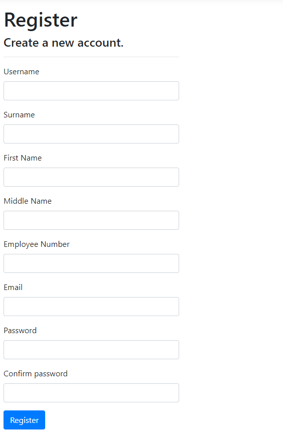

We can now register new users with a username and their registration data also contains their full name and employee number.

We can also login using username instead of email.

We must remember to only allow administrators access to this view.

### Reset Password

The administrator will need an option to reset a user's password. This will be added to a Manage Users component which will also contain assigning privileges. 


### Change Password

The user will need an option to change their password. This already exists in the ChangePassword.cshtml

We will first modify Index.cshtml contained in Identity-Pages-Account-Manage and remove the Email, Phone number, "Send verification email" and Save button option

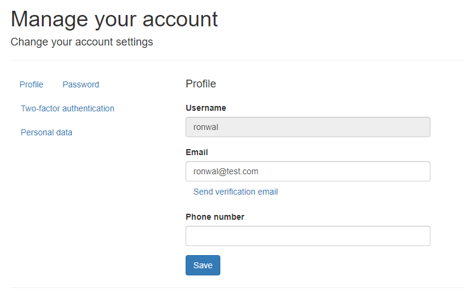


The navigation menu component is contained in _ManageNav.cshtml where we remove all options except Profile and Password.

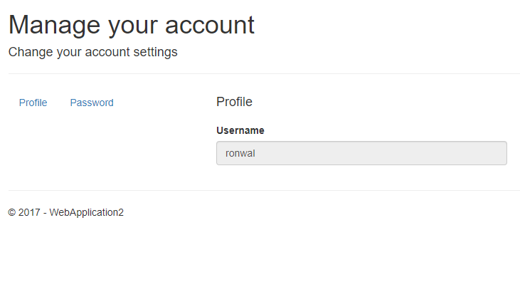


## Authorization

For a flexible approach to authorization we will use a claims/policy based approach. We need to identify all points in the application where a user is required some privilege to perform the task.
This privilege is defined as a claim within ASP.Net Core.

_e.g._ Access to a view vs access to create or modify new records associated with that view

These claims need to be defined within the application which will then allow us to create roles and dynamically assign these claims.

_e.g._  A role callled View_Customers will be assigned the claim View_Customers_Claim another role
Create_Customers will be assigned a claim Create_Customers_Claim.

We can even create a role called Customers which can contain both claims.

The user is then assigned these roles by an administrator.

To configure this we set up a role requirements for the declared policies creating a declaration similar to

```
 services.AddAuthorization(options =>
      {
          options.AddPolicy(PolicyNames.AdministratorPolicy, policy => policy.Requirements.Add(new AuthorizationNameRequirement(PolicyNames.AdministratorPolicy)));
          options.AddPolicy(PolicyNames.SupervisorPolicy, policy => policy.Requirements.Add(new AuthorizationNameRequirement(PolicyNames.SupervisorPolicy)));
          options.AddPolicy(PolicyNames.EmployeePolicy, policy => policy.Requirements.Add(new AuthorizationNameRequirement(PolicyNames.EmployeePolicy)));
      });
```

### Area

Create a new Area called UserManagement

Create a list representing all the possible claims. For easier reading we will create the list based on the policy names.

Create a new folder called Constants

Create a class under the Constants folder containing the policy names

```
    public static class PolicyNames
    {
        public const string AccessToTest1ScreenPolicy = "ViewTest1Screen";
        public const string AccessToTest2ScreenPolicy = "ViewTest2Screen";

    }

```

and a class called ClaimNames with a list of the policy names

```
    public static class ClaimNames
    {
        public static List<string> ClaimName = new List<string>() {
            PolicyNames.AccessToTest1ScreenPolicy,
            PolicyNames.AccessToTest2ScreenPolicy
        };
    }

```

We need to create a requirements handler to complete the claims/policy configuration.
 
Create a new folder called AuthorizationHandler

Create a class AuthorizationNameRequirement

```
    public class AuthorizationNameRequirement : IAuthorizationRequirement
    {
        public string AuthorizationName { get; private set; }

        public AuthorizationNameRequirement(string authorizationName)
        {
            AuthorizationName = authorizationName;
        }
    }

```

and AuthorizationNameHandler

```
    public class AuthorizationNameHandler : AuthorizationHandler<AuthorizationNameRequirement>
    {
        protected override Task HandleRequirementAsync(AuthorizationHandlerContext context, AuthorizationNameRequirement requirement)
        {
            if (context.User.HasClaim(c => c.Type == requirement.AuthorizationName))
            {
                context.Succeed(requirement);
            }
            return Task.CompletedTask;
        }
    }
```

We then add the authorization service to the ConfigureServices method in Startup.cs

```
            services.AddAuthorization(options =>
            {
                options.AddPolicy(PolicyNames.AccessToTest1ScreenPolicy, policy => policy.Requirements.Add(new AuthorizationNameRequirement(PolicyNames.AccessToTest1ScreenPolicy)));
                options.AddPolicy(PolicyNames.AccessToTest2ScreenPolicy, policy => policy.Requirements.Add(new AuthorizationNameRequirement(PolicyNames.AccessToTest2ScreenPolicy)));
            });

            services.AddSingleton<IAuthorizationHandler, AuthorizationNameHandler>();

```

Using MVC we can decorate our actions with something like

[Authorize(Policy = PolicyNames.AccessToTest1ScreenPolicy)] 

to control the access. A user would need the claim ViewTest1Screen to access this action.

#### Role Creation

Our next step is Role Management. 

 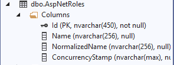

Create a viewmodel in the Models folder and create the maintenance views

```
    public class ApplicationRolesViewModel
    {
        public string Id { get; set; }
        [Display(Name = "Role Name")]
        [Required]
        public string RoleName { get; set; }
    }

```

In the Identity area, modify the IdentityHostingStartup.cs to support the creation of roles by
adding `AddRoles<IdentityRole>()` to the default identity configuration.

```
        services.AddDefaultIdentity<WebApplication2User>()
            .AddRoles<IdentityRole>()
            .AddEntityFrameworkStores<WebApplication2Context>();

```

Add a new route defining areas to the Configure methods in startup.cs
```
    routes.MapRoute(
        name: "areaRoute",
        template: "{area:exists}/{controller=Home}/{action=Index}/{id?}");

```

Create a Application Role controller and scaffold the index, create, edit and delete views based on ApplicationRolesViewModel.

Run the application and enter the URL to manage the application role something similar to

https://localhost:44328/UserManagement/ApplicationRole

We will see a view similar to the below. Displaying ID is not necessary so it should be removed/hidden in the views.

 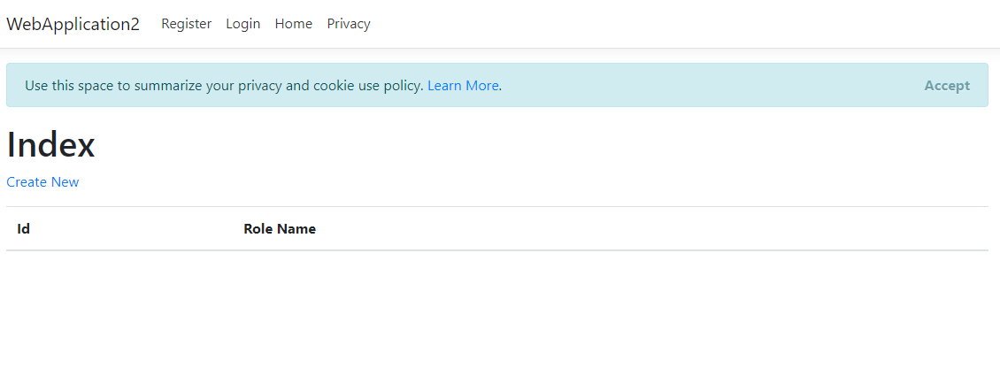

#### Assign Claims

We now need to add an option to assign claims to the application roles.

Create two viewmodels ClaimsViewModel and RoleClaimsViewModel

Modify ApplicationRoleController by adding two new action tasks to add the claims to roles. Create a new view ManageClaims. 

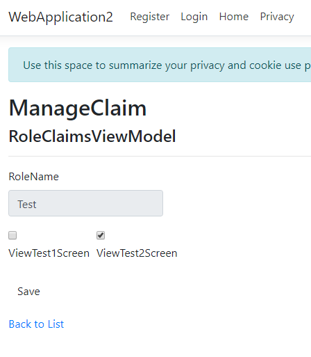

We can use checkboxes to represent each claim and just list them in a row but if you have an application which has 100 claims you may probably want a different UI.  

### Role Assignment

Now that our roles have claims we need a method to assign roles to users. At the same time we can allow editing of user information. 

Create three new view models UserListViewModel, UserEditViewModel and UserRolesViewModel.

Create a new controller UserEditController for editing user details and adding/deleting roles from a user.

Remember to add the area definition to the controller as we are placing this controller in the UserManagement area. We define it as follows.

```
namespace WebApplication2.Areas.UserManagement.Controllers
{
    [Area("UserManagement")]

```

Scaffold the index view from the UserListViewModel and remove the "Create New" option, as we are still using the default Identify area to create users, and the Details option. 

The user list will look similar to the below.

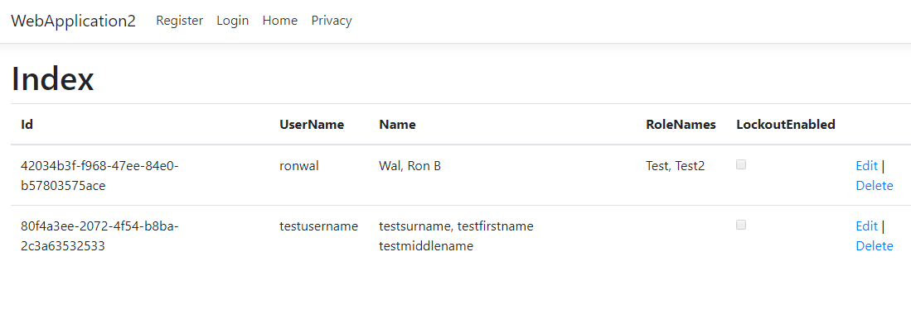

Scaffold an Edit view using the UserEditViewModel. This view is used to edit user details and assign roles.

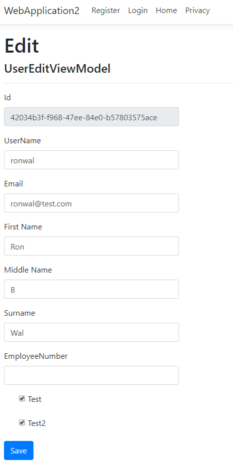

### Lockout and Unlock User
Entering an incorrect password after a predetermined number of times will lockout a user and sometimes it is required to disable a user account.

Create a viewmodel UserLockoutViewModel and actions to UserEditController to lockout and unlock a user. Create two views Lockout and UnLock to perform the lockout and unlock operations.

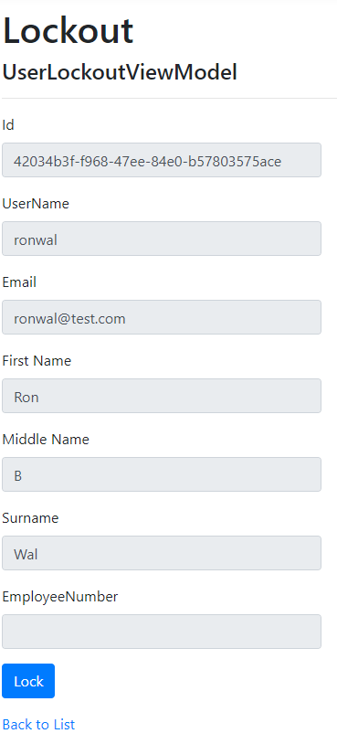

It isn't really necessary to create the associated viewmodel, the view can just contain a button to perform the action. 

### Reset Password

The system administrator needs an option to reset a user's account. Create a viewmodel UserPasswordResetViewModel and create a new action in UserEditController to reset the password.

### Delete User
Deleting a user in a production system is never recommended unless it is part of your audit procedures.
When access is no longer required for a user the user should be locked out or put into some type of audit state.
But we can add a delete action to UserEditController and a Delete view prompting to delete the user.

Still, probably not recommended in practically all situations.

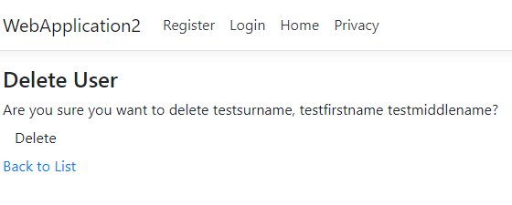


## Menu Changes
These options now have to be added to the menu. They should only display for authorised logged in users. In this example we can ignore authorization and display the menu for all logged in users.

We can create a partial view _LoginAuth similar to  \Views\Shared\_LoginPartial and add it to the _Layout view.

```
@using Microsoft.AspNetCore.Identity
@using WebApplication2.Areas.Identity.Data
@inject SignInManager<WebApplication2User> SignInManager
@inject UserManager<WebApplication2User> UserManager

    <ul class="navbar-nav">
        @if (SignInManager.IsSignedIn(User))
        {
        <li class="nav-item dropdown">
            <a class="nav-link dropdown-toggle" data-toggle="dropdown" href="#" role="button" aria-haspopup="true" aria-expanded="false">
                Administration
            </a>
            <div class="dropdown-menu" aria-labelledby="Administration">
                <a class="dropdown-item" id="register" asp-area="Identity" asp-page="/Account/Register">Create User</a>
                <a class="dropdown-item" id="role" asp-area="UserManagement" asp-controller="ApplicationRole" asp-action="Index">Role Management</a>
                <a class="dropdown-item" id="role" asp-area="UserManagement" asp-controller="UserEdit" asp-action="Index">User Management</a>
            </div>
        </li>
        }
    </ul>
```

In a production system we should remove the Register option from _LoginPartial, add authorization policies and create a startup module which initializes the system with an admin user account.

We can first create our authorization policy then initialize the system with an administration user.

Add a new claim name (based on the policy name) and policy name in ClaimNames.cs and PolicyNames.cs respectively

```
public static List<string> ClaimName = new List<string>() {
            PolicyNames.AccessToTest1ScreenPolicy,
            PolicyNames.AccessToTest2ScreenPolicy,
            PolicyNames.AdministratorPolicy  

```

```
public const string AdministratorPolicy = "Administrator";

```

Modify Startup.cs with an InitializeAdministrator method 

```
    private async Task InitializeAdministrator(IServiceProvider serviceProvider)
    {
        var roleManager = serviceProvider.GetRequiredService<RoleManager<IdentityRole>>();
        var userManager = serviceProvider.GetRequiredService<UserManager<WebApplication2User>>();
        string roleName = "Administrator";
        IdentityResult roleResult;

        //create an administrator role
        var roleExist = await roleManager.RoleExistsAsync(roleName);
        if (!roleExist)
        {
            roleResult = await roleManager.CreateAsync(new IdentityRole(roleName));
            if (roleResult.Succeeded)
            {
                //add the administrator related claim to the administrator role
                Claim claim = new Claim(PolicyNames.AdministratorPolicy, "");
                IdentityRole identityRole = await roleManager.FindByNameAsync(roleName);
                IdentityResult claimResult = await roleManager.AddClaimAsync(identityRole, claim);
                    
            }
        }

        var administratorUser = new WebApplication2User
        {
            UserName = Configuration.GetSection("UserSettings")["UserName"],
            Surname = Configuration.GetSection("UserSettings")["UserSurname"],
            FirstName = Configuration.GetSection("UserSettings")["UserFirstname"]
        };

        string UserPassword = Configuration.GetSection("UserSettings")["UserPassword"];
        var adminUser = await userManager.FindByNameAsync(Configuration.GetSection("UserSettings")["UserName"]);

        if (adminUser == null)
        {
            IdentityResult identityUser = await userManager.CreateAsync(administratorUser, UserPassword);
            if (identityUser.Succeeded)
            {
                //add the Administrator role to the user 
                await userManager.AddToRoleAsync(administratorUser, roleName);

            }
        }
    }

```

and call it from the Configure method.

```
InitializeAdministrator(serviceProvider).Wait();

```

Add an IServiceProvider parameter to Configure

```
public void Configure(IApplicationBuilder app, IHostingEnvironment env, IServiceProvider serviceProvider) 

```
Add username configuration to appsettings.json

```
  "UserSettings": {
    "UserName": "Administrator",
    "UserPassword": "P@ssw0rd",
    "UserSurname": "Administrator",
    "UserFirstame": "Administrator"
  }
```

Add an authorization policy to ApplicationRoleController

```
    [Authorize(Policy = PolicyNames.AdministratorPolicy)]

```

If we now login as a test user we see the following message. Only the username Administrator has the required cliam to be granted access.
 
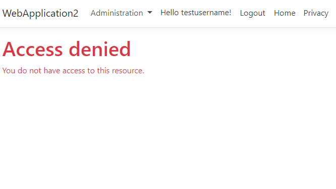


This provides an example of the configuration required to authentication and authorization for LOB ASP .NET Core applications and is in no way complete.
Logging should be added for every action and all exceptions. Paging and searching needs to be completed and the page actions associated with the scaffolded *Identity* which are not required should be removed.